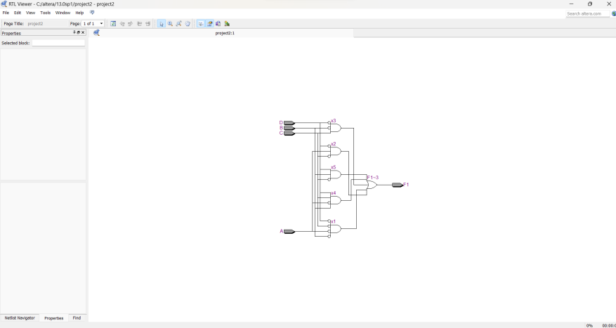

# Experiment--02-Implementation-of-combinational-logic
Implementation of combinational logic gates
 
## AIM:
To implement the given logic function verify its operation in Quartus using Verilog programming.
 F1= A’B’C’D’+AC’D’+B’CD’+A’BCD+BC’D
F2=xy’z+x’y’z+w’xy+wx’y+wxy
 
 
 
## Equipments Required:
## Hardware – PCs, Cyclone II , USB flasher
## Software – Quartus prime


## Theory
 Logic gates are electronic circuits which perform logical functions on one or more inputs to produce one output.


## Logic Diagram
## Procedure
## Program:
Developed by: Sriram G
RegisterNumber: 212222230149 

```
module proj2(A,B,C,D,F1);
input A,B,C,D;
output F1;
wire x1,x2,x3,x4,x5;
assign x1 = (~A)&(~B)&(~C)&(~D);
assign x2 = (A)&(~C)&(~D);
assign x3 = (~B)&(C)&(~D);
assign x4 = (~A)&(B)&(C)&(D);
assign x5 = (B)&(~C)&(D);
assign F1 = x1+x2+x3+x4+x5;
endmodule
```
## Output:
## RTL

## Truth Table

## Timing Diagram

## Result:
Thus the given logic functions are implemented using  and their operations are verified using Verilog programming.
